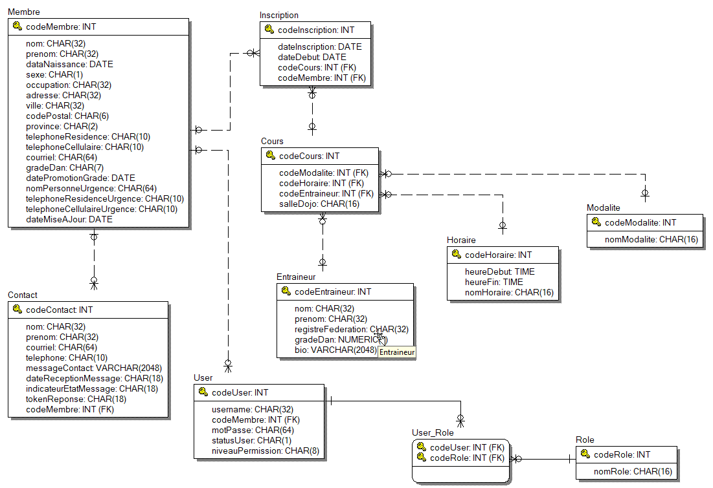

[](https://www.quebec.ca/gouv/politiques-orientations/vitrine-numeriqc/accompagnement-des-organismes-publics/demarche-conception-services-numeriques)
[](LICENSE)

---
[Version Française](README_fr_ca.md)
# CJQ-Club de Judo de Quebec

<p align="center">
    
</p>

Implementation de site pour mandat du RAC.

Le Club de Judo de Québec désire se doter d'un site web pour afficher ses activités, donner des informations et prendre des inscriptions. Il vous demande d'effectuer l'analyse et le développement de ce site. 

Le club veut une page d'accueil à partir de laquelle les visiteurs pourront choisir l'option désirée (un peu comme les sites compétiteurs). Les choix possibles à partir de cette page d'accueil sont:  

* **Accueil:** page principale présentant l'information de base sur le Club; 
* **Cours:** cours offerts, coûts, horaires, et inscriptions en ligne; 
* **Ceinture:** information sur les ceintures; 
* **Compétition:** calendrier des compétitions, résultats et classements; 
* **Équipement:** liste du matériel, prix, achat en ligne; 
* **Gestion:** sert à la mise à jour des classements, inscriptions des équipes, etc, uniquement accessible aux gestionnaires du site. 

### Synopsis

At the top of the file there should be a short introduction and/ or overview that explains **what** the project is. This description should match descriptions added for package managers (Gemspec, package.json, etc.)

### Motivation

A short description of the motivation behind the creation and maintenance of the project. This should explain why the project exists.

## Getting Started / Commencer

These instructions will get you a copy of the project up and running on your local machine for development and testing purposes. See deployment for notes on how to deploy the project on a live system.

### Prerequisites / Pré-requis

In order to build and run the Club de Judo de Quebec's application, you must have some pre-installed basic software. 

First, you must have `node` installed in your system, along with its package manager, `npm`. This is essential, as node is the basis upon which all the application is built. 

If you are running under `windows` you must install `Git Bash` and support for `git` in your enviroment, and execute all further instruction on `Git Bash`'s shell. The windows command line isn't enough to build and run the application environment. 

You must also have `Docker` installed. Although it is possible to deploy the several pieces of software that compose this application separately, it would be work intensive and very error prone. `Docker` allows for a standardized deployment process and simplifies the instalation of prerequisite software, which can be installed directly on the container instead of on the host. The database, for instance, will be installed on the container and not on the host. 

All the other prerequisites necessary for this application will be dealt with by `node` and `docker`. 

### Installing

If you haven't done it yet, clone this application code to your computer. 

```
git clone https://github.com/torjc01/CJQ-ClubJudoQuebec
```

Afterwards, you must configure the environment variables, that control the execution os the various parts of the docker container.  

Open the file `./docker/manage`, find the function `configureEnvironment()` and change the following variables to reflect your own environment: 

- `API_PORT`: the api port; e.g `8001`

- `APP_PORT`: the application frontend port; e.g `8002`

- `MYSQL_DATABASE`: the database to be created; e.g. `'dummy'`

- `MYSQL_ROOT_PASSWORD`: the password for the database root user; e.g `'blitzkrieg'`

- `MYSQL_PORT_LOCAL`: the database port on the local machine; e.g. `3308`

- `MYSQL_PORT_CONTAINER`: the database on the container port; e.g. `3308`

- `MYSQL_PERSISTENCE_LOCALDIR`: the local dir where the persistent database files will be stored; e.g. `'~/Development/mysql-container/data'`. You should use your operating system's naming convention to setup the persistence local dir. For instance, if you're using windows, the example above could be redefined as `'C:\Development\mysql-container\data'`. 

- `ADMINER_PORT_LOCAL`: adminer local machine port, e.g. `8888`

- `ADMINER_PORT_CONTAINER`=adminer container port, e.g. `8080`

- `MAILDEV_HOST`=maildev host, e.g. `maildev`

- `MAILDEV_PORT`=maildev listening port, e.g. `7050`

Also, create a `.env` file under the `cjq-api` directory, and define the following environment vars: 

- `APP_NAME`="API Provider pour Club de Judo de Quebec"
- `HOST_NAME`=http://localhost
- `PORT`=8001
- `SWAGGER_FILE`="./swagger.json"
- `LOG_FILE`="./logs/log.txt"
- `DATA_FILE`=""

Then, use the `manage` shell script to build the application.

```
$ cd docker
$ ./manage build 
```

Now, the last step is to build the database container. It will setup a `mysql server community edition` container answering on port 3308, and `Adminer`, a web application for database admin, on port 8888. 

``` 
$ ./manage build-db
```
## Example Use

To launch the application, run the following script: 

```
cd docker
$ ./manage start
```

Once the application's containers are up, you will find the following endpoints available: 

- **The API** (http://localhost:8001/api)

- **The API docs** (http://localhost:8001/api-docs)

- **The frontend** (http://localhost:8002)

- **The database admin page** (http://localhost:8888)

- **The mail server** (http://localhost:7050)

To stop the application, and keep the containers ready on your docker, simply make a `stop`: 

```
$ ./manage stop
```

On the other hand, if you want to destroy the containers, you must do a `down` or `rm` (they are equivalent): 

```
$ ./manage down
```


Show what the library does as concisely as possible, developers should be able to figure out **how** your project solves their problem by looking at the code example. Make sure the API you are showing off is obvious, and that your code is short and concise.

## API Reference

The API documentation for the project is available at the address [Swagger OpenAPI](http://localhost:8001/api-docs/).

Depending on the size of the project, if it is small and simple enough the reference docs can be added to the README. For medium size to larger projects it is important to at least provide a link to where the API reference docs live.

The data model is simplified for the RAC's requisites, yet it is still complex enough to demonstrate knowledge on dealing with data modelling and database programming / administration. 

The model has 7 basic tables, described below: 

- `MEMBRE`: A club's member personnal data
- `INSCRIPTION`: This is an inscription a member has on a course, past or present.
- `COURS`: Courses options available on the dojo;
- `HORAIRE`: Schedule options for courses on the dojo; 
- `MODALITE`: Modality of course members can choose from; 
- `ENTRAINEUR`: Data about the coaches teaching the various courses;
- `CONTACT`: Contacts done either by the club's members or the general public, via a contact form on the web application. 

Below, you will find the logical and physical data model diagrams for this database. 

<p align="center">
    <p><b>Logical data model</b></p>
    
</p>

<p align="center">
    <p><b>Physical data model</b></p>
    
</p>


<p><b>Access to the database</b></p>

To access the database administration tool (`Adminer`), access its address and log in using the following information, valid for a development environemt: 

- `System: MySQL`
- `Server: db`
- `Username: cjqweb`
- `Password: 123456`
- `Database: CJQ`

Please note that these values are case-sensitive. 
<p>

</p>


## Running the tests

Explain how to run the automated tests for this system

### Break down into end to end tests

Explain what these tests test and why

```
Give an example
```

### And coding style tests

Explain what these tests test and why

```
Give an example
```

## Deployment

Add additional notes about how to deploy this on a live system

## Built With

* [Node.js](https://nodejs.org/en/) - Javascript runtime
* [Docker](https://docker.com) - Container platform for rapid app/microservices development and delivery
* [ReactJS](https://reactjs.org/) - A JavaScript library for building user interfaces
* [Angular](https://angular.io/) - AngularJS is a toolset for building a framework suited to application development. It is fully extensible and works well with other libraries.
* [Bootstrap](https://getbootstrap.com) - Bootstrap is a css library that is a popular front-end open source toolkit. 
* [MySQL](https://www.mysql.com/) - Open source relational database
* [Ngrok](https://ngrok.com/) - Exposes local servers behind NATs and firewalls to the public internet over secure tunnels.
* [Openshift](https://www.openshift.com/) - Open source container application platform based on the Kubernetes container orchestrator for enterprise app development.

## Contributing / Contribuer

Found a bug? Ready to submit a `PR`? Want to submit a proposal for your grand idea? Please read [CONTRIBUTING.md](Contributing.md) for details on our code of conduct, and the process for submitting pull requests to us.

Vous avez trouvé un bug? Êtes-vous prêt à soumettre un `PR`? Voulez-vous soumettre une proposition pour votre grande idée? Merci de lire [CONTRIBUTING.md](Contributing.md) pour des détails sur notre code de conduite, et le processus pour nous soumettre des `pull requests`. 

## Versioning

We use [SemVer](http://semver.org/) for versioning. For the versions available, see the [tags on this repository](https://github.com/your/project/tags). 

Nous utilisons [SemVer](http://semver.org/) pour faire le versionement. Pour les versions disponibles, voir les [tags dans ce répo](https://github.com/torjc01/CJQ-ClubJudoQuebec/tags). 

## Authors / Auteurs 

* **Julio Cesar Torres** - *Initial work* - [torjc01](https://github.com/torjc01)

See also the list of [contributors](https://github.com/torjc01/CJQ-ClubJudoQuebec/contributors) who participated in this project.

[https://developercertificate.org/](https://developercertificate.org/)

Voyez aussi la liste de [contributeurs](https://github.com/torjc01/CJQ-ClubJudoQuebec/contributors) qui ont participé à ce projet. 

## License

The CJQ website is licensed under the Apache 2.0 License - see the [LICENSE.md](LICENSE.md) file for details

Le site web du CJQ est licensé sous la license Apache 2.0 - voir le fichier [LICENSE.md](LICENSE.md) pour plus de détails. 


## Acknowledgements / Remerciements

* M Jean-François Savard, de m'avoir demandé cette implémentation. 
* Au Club de Judo de la Vieille Capitale, qui m'a accueilli lors de mon arrivé au Québec avec toute la convivialité de l'Art de la Voie de la Souplesse.
* To the site [Unsplash](https://unsplash.com/), for the high quality photos available for free to the developer community. 
* Hat tip to anyone whose code was used
* Inspiration
* etc

## References / Références 

* [Club de Taeknowdo CRSA](https://www.tkd-crsa.com/)
* [Taekwondo Ste-Foy](http://tkd-ste-foy.com/)
* [Club de Judo de la Vieille Capitale](https://www.judovieillecapitale.com/)
* [Club De Judo Aikibudo De Charlesbourg](http://www.judoaikibudocharlesbourg.com/)
* [Dojo de Beauport](https://dojobeauport.com/)
* [Judo Club Lévis](https://judolevis.ca/)